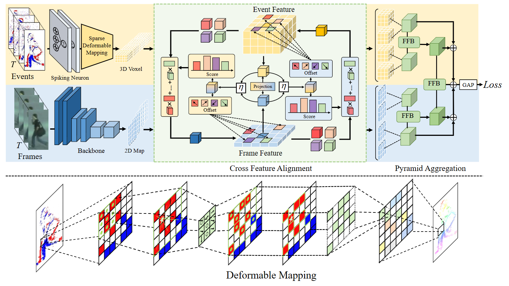
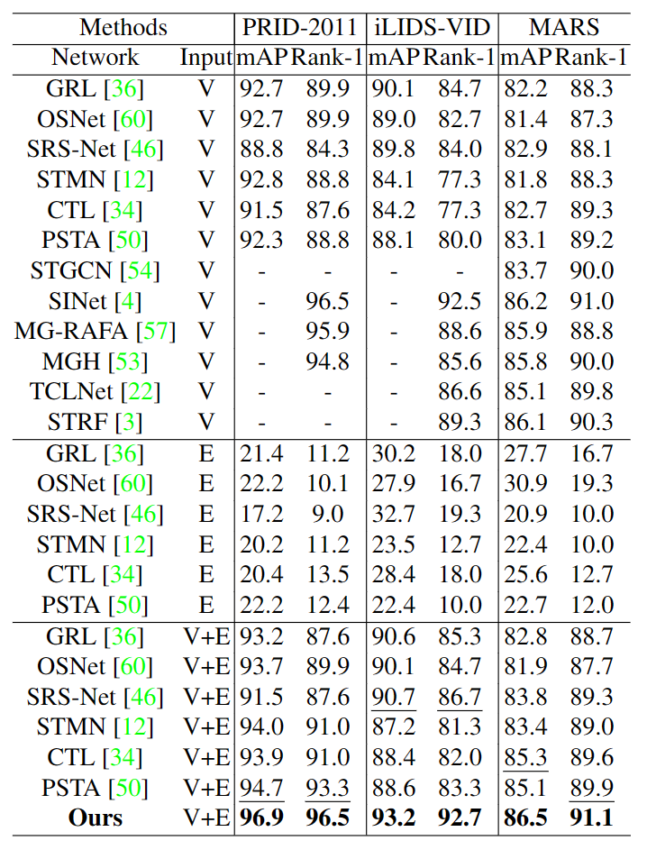
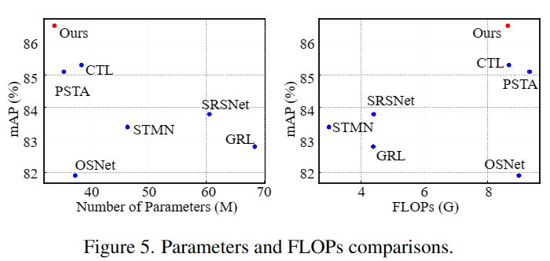
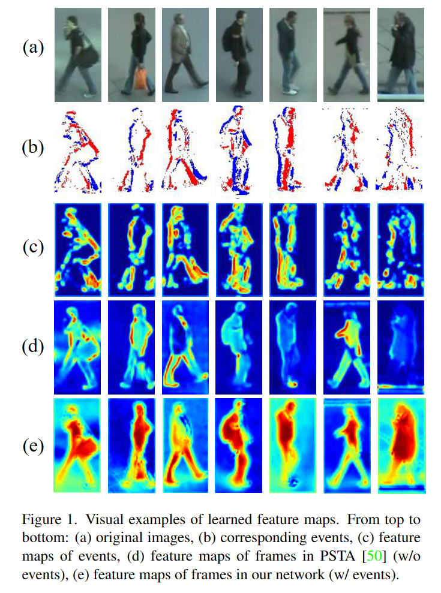

# Event-guided Person Re-Identification via Sparse-Dense Complementary Learning



This repository provides the official PyTorch implementation of the following paper (**CVPR 2023**):

 Event-guided Person Re-Identification via Sparse-Dense Complementary Learning

 Chengzhi Cao, Xueyang Fu*, Hongjian Liu, Yukun Huang, Kunyu Wang, Jiebo Luo, Zheng-Jun Zha


 Paper Link:

 Video-based person re-identification (Re-ID) is a prominent computer vision topic due to its wide range of video surveillance applications. Most existing methods utilize spatial and temporal correlations in frame sequences to obtain discriminative person features. However, inevitable degradations, e.g., motion blur contained in frames often cause ambiguity texture noise and temporal disturbance, leading to the loss of identity-discriminating cues. Recently, a new bio-inspired sensor called event camera, which can asynchronously record intensity changes, brings new vitality to the Re-ID task. With the microsecond resolution and low latency, event cameras can accurately capture the movements of pedestrians even in the aforementioned degraded environments. Inspired by the properties of event cameras, in this work, we propose a Sparse-Dense Complementary Learning Framework, which effectively extracts identity features by fully exploiting the complementary information of dense frames and sparse events. Specifically, for frames, we build a CNN-based module to aggregate the dense features of pedestrian appearance step-by-step, while for event streams, we design a bio-inspired spiking neural backbone, which encodes event signals into sparse feature maps in a spiking form, to present the dynamic motion cues of pedestrians. Finally, a cross feature alignment module is constructed to complementarily fuse motion information from events and appearance cues from frames to enhance identity representation learning. Experiments on several benchmarks show that by employing events and SNN into Re-ID, our method significantly outperforms competitive methods.

---

## Contents

The contents of this repository are as follows:

1. [Dependencies](#Dependencies)
2. [Dataset](#Dataset)
3. [Train](#Train)
4. [Test](#Test)

---

## Dependencies

- Python
- Pytorch (1.4)
- scikit-image
- opencv-python

---

## Dataset

### MARS
Experiments on MARS, as it is the largest dataset available to date for video-based person reID. Please follow [deep-person-reid](https://github.com/KaiyangZhou/deep-person-reid) to prepare the data. The instructions are copied here: 

1. Create a directory named `mars/`.
2. Download dataset to `mars/` from http://www.liangzheng.com.cn/Project/project_mars.html.
3. Extract `bbox_train.zip` and `bbox_test.zip`.
4. Download split information from https://github.com/liangzheng06/MARS-evaluation/tree/master/info and put `info/` in `data/mars` (we want to follow the standard split in [8]). The data structure would look like:
5. Download `mars_attributes.csv` from http://irip.buaa.edu.cn/mars_duke_attributes/index.html, and put the file in `data/mars`. The data structure would look like:
```
mars/
    bbox_test/
    bbox_train/
    info/
    mars_attributes.csv
```
6. Change the global variable `_C.DATASETS.ROOT_DIR` to `/path2mars/mars` and `_C.DATASETS.NAME` to `mars` in config or configs.

### iLIDS-VID

* Create a directory named ilids-vid/ under data/.

* Download the dataset from http://www.eecs.qmul.ac.uk/~xiatian/downloads_qmul_iLIDS-VID_ReID_dataset.html to "ilids-vid".

* Organize the data structure to match

```
ilids-vid/
    i-LIDS-VID/
    train-test people splits
```

---

## Train

To train SDCL , run the command below:

``` 
python Train_event_vid.py   --arch 'STMN_Net_deform2'\
                  --config_file "./configs/softmax_triplet.yml"\
                  --dataset 'prid_event_vid'\
                  --test_sampler 'Begin_interval'\
                  --triplet_distance 'cosine'\
                  --test_distance 'cosine'\
                  --seq_len 8 
```

---

## Test

To test SDCL, run the command below:

``` 
python Test.py  --arch 'STMN_Net_deform2'\
                --dataset 'prid_event_vid'\
                --test_sampler 'Begin_interval'\
                --triplet_distance 'cosine'\
                --test_distance 'cosine'
 ```

---

## Performance


### Comparision with SOTA



### Better trade-off between speed and performance:


More experiments result can be found in paper.

## Visualization



## Contact
Should you have any question, please contact chengzhicao@mail.ustc.edu.cn.

